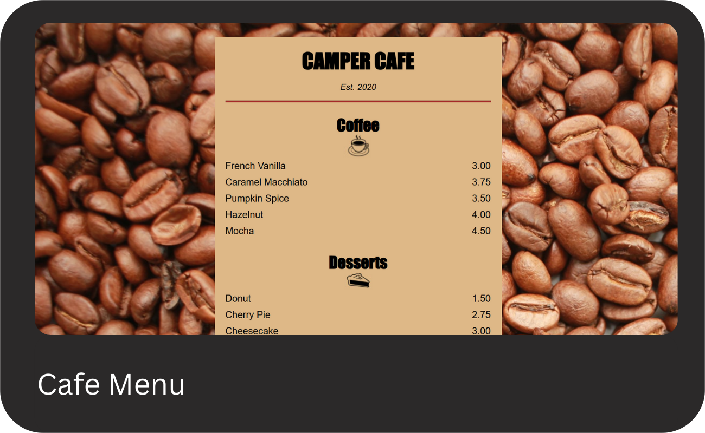
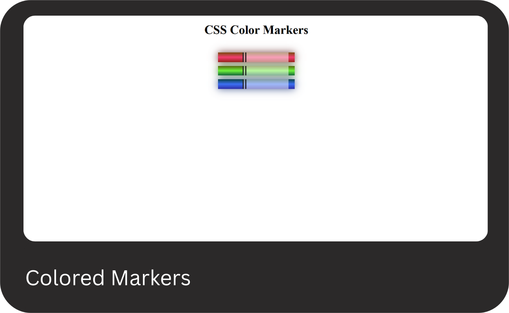

# FreeCodeCamp-Project

This repository contains all projects built following the [freeCodeCamp(🔥)](https://www.freecodecamp.org/learn).

## Projects List

## [01 - Responsive Web Design](https://www.freecodecamp.org/learn/2022/responsive-web-design/)

[Cat Photo App](https://www.freecodecamp.org/learn/2022/responsive-web-design/learn-html-by-building-a-cat-photo-app/step-1), [Cafe Menu](https://www.freecodecamp.org/learn/2022/responsive-web-design/learn-basic-css-by-building-a-cafe-menu/step-1),\
[Set of Colored Markers](https://www.freecodecamp.org/learn/2022/responsive-web-design/learn-css-colors-by-building-a-set-of-colored-markers/step-1), [Registration Form](https://www.freecodecamp.org/learn/2022/responsive-web-design/learn-html-forms-by-building-a-registration-form/step-1),\
[Survey Form](https://www.freecodecamp.org/learn/2022/responsive-web-design/build-a-survey-form-project/build-a-survey-form), [Rothko Painting](https://www.freecodecamp.org/learn/2022/responsive-web-design/learn-the-css-box-model-by-building-a-rothko-painting/step-1),\
[Photo Gallery](https://www.freecodecamp.org/learn/2022/responsive-web-design/learn-css-flexbox-by-building-a-photo-gallery/step-1), [Nutrition Label](https://www.freecodecamp.org/learn/2022/responsive-web-design/learn-typography-by-building-a-nutrition-label/step-1),\
[Quiz WebPage](https://www.freecodecamp.org/learn/2022/responsive-web-design/learn-accessibility-by-building-a-quiz/step-1), [Tribute page](https://www.freecodecamp.org/learn/2022/responsive-web-design/build-a-tribute-page-project/build-a-tribute-page),\
[Balance Sheet](https://www.freecodecamp.org/learn/2022/responsive-web-design/#learn-more-about-css-pseudo-selectors-by-building-a-balance-sheet), [Cat Painting](https://www.freecodecamp.org/learn/2022/responsive-web-design/#learn-intermediate-css-by-building-a-cat-painting),\
, ,\

### Click any of the images below to view the readme and live demo of the project.

  
  

  
  

  
  

  
  

  
  

  
  

