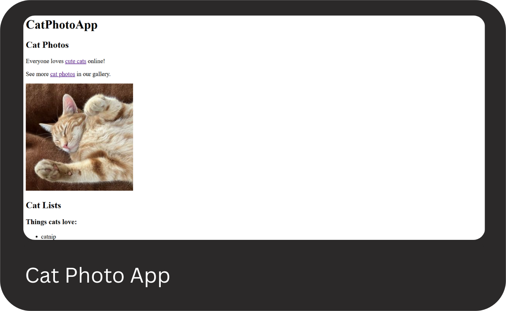

# FreeCodeCamp-Project

This repository contains all projects built following the [freeCodeCamp(🔥)](https://www.freecodecamp.org/learn).

## Projects List

## [01 - Responsive Web Design](https://www.freecodecamp.org/learn/2022/responsive-web-design/)

[Cat Photo App](https://www.freecodecamp.org/learn/2022/responsive-web-design/learn-html-by-building-a-cat-photo-app/step-1), [Cafe Menu](https://www.freecodecamp.org/learn/2022/responsive-web-design/learn-basic-css-by-building-a-cafe-menu/step-1),\
[Set of Colored Markers](https://www.freecodecamp.org/learn/2022/responsive-web-design/learn-css-colors-by-building-a-set-of-colored-markers/step-1), [Registration Form](https://www.freecodecamp.org/learn/2022/responsive-web-design/learn-html-forms-by-building-a-registration-form/step-1),\

### Click any of the images below to view the readme and live demo of the project.

  
  

  
  

